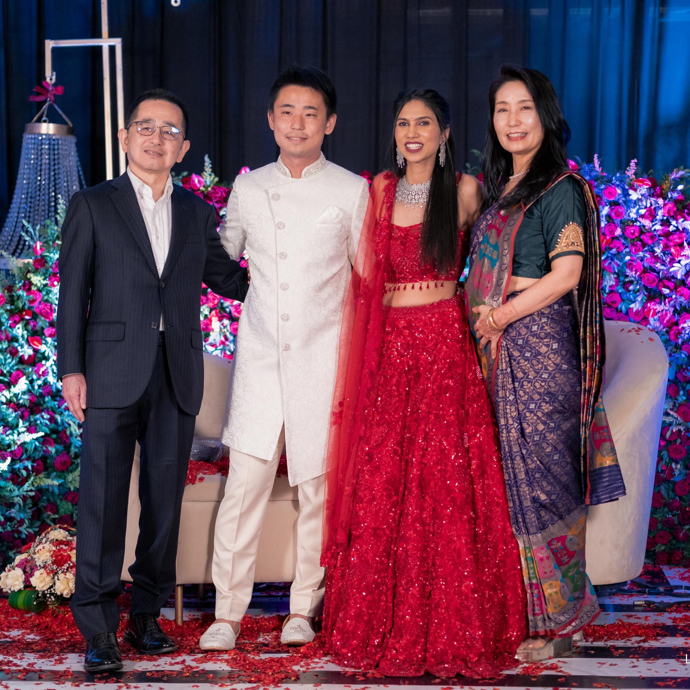



#  Shreya  &  Kaito 

  

    <h2>We are Getting Married!</h2>
    <h3><strong>February 3rd - 6th, 2026</strong></h3>
    <h3><strong><a href="https://www.mirayagreens.com/" target="_blank">Miraya Greens</a>, Bangalore, India</strong></h3>
  

  

    

      

        

          
        

        

          
        

        

          
        

        

          
        

        

          
        

        

          
        

        

          
        

      

      <button class="carousel-btn prev-btn" id="prevBtn" aria-label="Previous photo">‹</button>
      <button class="carousel-btn next-btn" id="nextBtn" aria-label="Next photo">›</button>
      

        <button class="indicator active" onclick="goToGallerySlide('engagement', 0)"></button>
        <button class="indicator" onclick="goToGallerySlide('engagement', 1)"></button>
        <button class="indicator" onclick="goToGallerySlide('engagement', 2)"></button>
        <button class="indicator" onclick="goToGallerySlide('engagement', 3)"></button>
        <button class="indicator" onclick="goToGallerySlide('engagement', 4)"></button>
        <button class="indicator" onclick="goToGallerySlide('engagement', 5)"></button>
        <button class="indicator" onclick="goToGallerySlide('engagement', 6)"></button>
      

    

  

